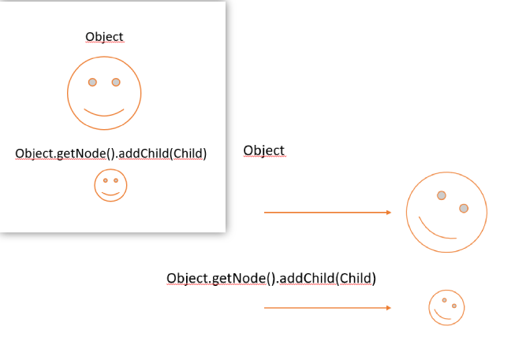

# Objects

Objects are all the entities that inherit code existing at the moment in your game, objects can be instantiated and destroyed, they carry components, that define what they are what they do. A component is a script with code meant to solve certain tasks related to the mechanics of your game, this components can be added or created, with the most basic ones being already programmed and available to be used, namely an image renderer, a collider, a camera component, etc.

An object can be defined by it's unique name or it's unique id, the id is the index of ther order in which objects are added, it's name is also unique but can be given by the programmer, when two objects are assigned the same name, a warning is thrown, and the last to be instantiated is assigned an alternative name.

```
[WARNING] The name Wall was already atributed to a different object, The new name of this object will be: Wall0
```

## Creating Objects

An object is another code file that extends the _Object_ class and should implement the _StdBehaviour_ interface. 
```java
public class Player extends Object implements StdBehaviour {

    public Player() {
        super("Player");
    }
    
    @Override
    public StdBehaviour getBehaviour() {return (StdBehaviour) this; }

    // Called once the object is initialized
    @Override
    public void Start() {
    }

    // Called every frame
    @Override
    public void Update(float deltaTime) {
    }

    @Override
    public void DrawGUI(Graphics2D g) {
    }

    @Override
    public void ReceiveMessage(String origin) {
    }
}
```

The _StdBehaviour_ interface furnishes the object with the useful methods you find in most other game engines, with the addition of some other methods that could be of use, including the _getBehaviour_ method that must not be edited.

To create an object the _HimawariCore_ static method _CreateObject_ must be called, as instantiating the Object is not enough to add it to the current game room.
To destroy an object, two approaches can be taken, to destroy one self's inside it's class
```java
DestroyInstance();
```
Or to use the static method _DestroyObject_ that destroys a certain object of name.
```java
Object.DestroyObject("Wall0");
```

## StdBehaviour interface
All objects should implement the "Standard Behaviour" interface, that interface defines all the methods that should be common to all game objects, namely: 
* Start
* Update
* DrawGUI
* ReceiveMessage
* GetBehaviour
All functions **but GetBehaviour** can be programmed to fit the developer's needs, dependent on the situation.

****Start** will be called after the object is instantiated;
**Update** will be called once every time the object is rendered, it receives the _delta_ argument, also known as delta time, is the time inbetween frames calculated on every update tick;
**DrawGUI** will also be called when the object is rendered, it must be used to draw graphics on the screen freelly with the java.awt library, it receives a Graphics2D object.
**ReceiveMessage** is called once a certain object is targeted as a message receiver, it receives a message

## Object hierarchy

The hierarchy is a way to relate objects to each other and make them inherit a parent's raw movement and help with quick searching objects and grouping them.
Here is an example of how the relation works:



All three basic translation functions are transmitted from parent to child, horizontal and vertical movement, rotation and scaling.
Moving a child will not affect a parent's tranform functions, as they are relative to the parent and not dependant. Once a child moves, it's position changes relatively from the parent. These behaviour can be stopped by setting the parameter Node.connected to false.

```java
Object obj = CreateObject("Sidekick", new Vec2(0, 0), 0, new Vec2(0, 0));
obj.node.setConnected(false);
```

### Nodes
An object is represented as a node, supreme parents are objects without a parent, they are directely inserted in the hierarchy. When instantiating an object a node of it will automatically be created as supreme parent, and children can be added to it using the funcion Node.addChildren to directly append a node to it, or the function Hierarchy.AddChildNodeTo to find an object and append a node to it.

Direct changes to a parent's transform using Transform.setPosition, Transform.setScale and Transform.setAngle will not change the object's children.

To disconnect or reconnect nodes, you may use the function Node.setConnected.

## Messages
An object can send a message to a different object and call it's _ReceiveMessage_ method, this works as an easy way of communication between objects.

Being it a better solution to manually getting the object and setting it's properties, allowing this way, the use of private variables.

### Using send message
```java
Object.sendMessageTo(this);
```

```java
@Overrite
public void ReceiveMessage(Object origin){

	if(origin.class.getName() == "Main"){
		//Do stuff
	}
}
```

### Without send message
While it looks simpler, it restricts the object's usage to only public variables and is an objectively less secure way of communicating between objects.
```java
Object player = Object.find("Player");
player.attribute = "new value"
```

edited: **Sagiri on 20/10/2022**
edited: **Sagiri on 22/10/2022**
edited: **Sagiri on 09/12/2022**