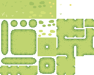

# Create a room

## Tile sets

Tile sets are sprite sheets with all the images that are meant to serve decorative purposes.
A collection of rectangular images, or tiles.

_Isometric tile sets are not supported_

To create a tile set the constructor receives thre[]()e parameters, the tile set image, the X width of a tile and the Y width of a tile
In this case for example:


```java
Sprite tileSheet = new Sprite("tiles.png");
TileSet tileset = new TileSet(tileSheet, 16, 16);
```

## Rooms
Rooms are where your object are placed in, they contain information on the placement of tiles and object spawning, you can make a game without a Room.

A room **must** be placed inside the Rooms folder in assets and each room has it's own folder with it's name.
Inside a room folder you may have:
* A room-tiles.txt
* A room-objects.txt

### room-tiles
The room tiles file has information on what tiles should be placed where:
```text
1 1 1 0 0 
0 1 24 5 0 
0 0 0 3 4
```
The room above is 5 tiles long and 3 tiles high, it goes to the referenced tile set object and gets the image of the mentioned index to draw it in it's position on the file.

### room-objects
The room objects file has information on what objects should be placed and where. It would be boring and result in messy code if all the objects off the room where to be instatiated manually, so this file takes all the information on position, rotation, and scaling of the objects that should be placed on the room beforehand, it can also be given an object name as an optional 4th parameter.<br>Format: ``` Wall 80-10 90 1-1 Wall1```

Optionally a 4th parameter may be given, the [object](Objects) name, it's name is attributed to the object once it's created to avoid "Name already attributed to a different object" warnings when compiling.

The line above instantiates an object of name "Wall" in the coordinates x=80 y= 10 rotated 90 degrees and with a scaling of x=1 y=1

to load the objects of the room, the function loadObjects() mus be called after each object's constructor id called once.
```java
Room room0 = new Room("fields", tileSet, new RoomData("room0"));

room0.loadObjects();
``` 

## Create a room
```java
Sprite tileSheet = new Sprite("tiles.png");
TileSet tileSet = new TileSet(tileSheet, 16, 16);

new Room("fields", tileSet, new RoomData("room0"));
```

## Load Rooms
The first Room ever added is considered the "startRoom" (RoomHandler.java line 14) it's the first Room to load when the game starts. Rooms can be changed using the roomGoto function, to go to a certain Room it must have been added to the room list first. Rooms are added to that list once their  constructor is called. 

```java
Room castle = new Room("castle", tileSet, new RoomData("room_castle"));
RoomHandler.roomGoto(castle);
```

# Create a Room using HimawariGUI
To import a map using HimawariGUI (you need to select a tileset for visualization purpouses in the oldest version of the software, the newer versions initialize with an empty black tileset and let you choose your image), the map folder only holds information for where each tile/object must go.
To create a map however, you need to select a map width, the height is automatically set to be the same, as the editor does not support rectangular maps in the current 1.1.0 version.

The editor can be opened both unlinked to a project, or opened along with the project editor wich initializes everything object related.

## The editor

![[editor 1.png]]

The editor is divided between 3 tabs.
The first and main one, Tools, provides tools to create a tile pattern and place objects on the map.
The button icons on the editor control panel are references to the famous Super Mario World ROM editor "Lunar Magic", from left to right, these are their functionalities:
* Change the current tile.
* Change layer. From tile placing mode to object placing mode or vice-versa.
* Set a placeable object.
* Tweak zoom settings.
* Change the camera position.
* Restart settings. Zoom, position, current tile, etc...
* Hide/Show Grid toggle
* Export map.
* Import map.

The second tab, Object Parameters, has input fields for you to input you object information if you have [objects](Objects) imported or already manually inputed an [object](Objects). 
If you did in fact import [objects](Objects), it means that by pressing the arrow button, you will cycle through your available [objects](Objects) and be able to place them.
![[tab2.png]]

The final tab is the Tileset and Project tab, it is made out of only 2 buttons, the _Import Tileset_ and _Import Objects_ button, that both open a file chooser window in where you input, respectivelly, the tile set image or the Assets/Objects directory of a himawari project. It will import all the objects of the folder to the Object chooser in the previous tab, additionally there is a shortcuts button, it displays an image with all the map editor shortcuts illustrated for quick use, like moving around, zooming and placing tiles.


last edited: **Sagiri on 12/10/2022**
last edited: **Sagiri on 22/10/2022**