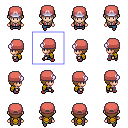
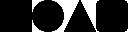

# Sprites
Sprites are the representation of an image in game, they can be assigned to objects as it's visual representation making use of the default component ImageRenderer.
To create a sprite, add an image to the Sprites folder in the Assets directory and create an object reference of the Sprite.
This process should normally take place inside an object's Start method.
```java
Sprite image = new Sprite("player.png");
```
The most simple constructor takes a parameter, the name of the file.
A sprite can also be created directly from a Buffered Image object.

## Get sprite from sprite sheet
There is a special constructor to extract an image from a sprite sheet, it receives an image, a start x position, a start y position, a width and a height.

To get the selected image, keeping in mind each cell has 64 pixels, the following constructor should be called:
```java
Sprite player = new Sprite("player.png", 0, 0, 64, 64);
```

## Default sprites
For testing purposes there are provided 4 default sprites for testing and to serve as placeholders, and these are:

They can be instantiated with their respective index:
```java
Sprite player = new Sprite(0); // Square
Sprite player = new Sprite(0); // Circle
```

## Image Utils
ImageUtil is a separate class that is meant for both the engine and the programmer to use when it's necessary to modify an image.

| Function   |      Description      |  Return | Parameters |
|----------|:------------------------:|:------:|:---------------|
| resizeImage |  takes an image and resizes it to a certain desired size | The resized image | targetWidth: the desired width; targetHeigth: the desired height; al: The scaling method (scaleAlgorithm.FAST or scaleAlgorithm.SMOOTH); sprite: The original BufferedImage |
| toBufferedImage |    converts the java.awt.Image format to a BufferedImage   |   The image converted | img: The originam Image object |
| flipImageHorizontal | flips ans image horizontally |    the flipped image | sprite: The original BufferedImage; |
| flipImageVertical | flips ans image vertically |    the flipped image | sprite: The original BufferedImage; |
| rotate | rotates an image | original image rotated by a certain angle | bimg: The original BufferedImage; angle: the amount in degrees to rotate; |

last edited: **22/10/2022**