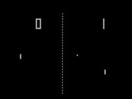

Let's make the famous old game pong!
Pong is one of the first computer games that were ever created, this simple "tennis like" game features two paddles and a ball.

## Setup
To start, we create a project called pong, and name our window "Pong!!", we will use the default Player object to draw the background.

## Paddles
The next step is to create playability, let's make the paddles that are controlled by both the player and an AI, to do that, we'll use the HimawariGUI app to create two objects named Paddle and Enemy.

We don't need images to draw the paddles, as they are only rectangles, so we can still use the Widget class to draw them, but as we need them to move across the screen we will make use of the [[Transform]] component, that comes by default with every object, to know where to draw the paddles.

## Movement
We'll now make our paddle move, it is rather simple, as it already uses our transform component, its position is automatically updated, we just need to Translate accordingly.

Let's start by defining a speed variable, so it can be controlled and customized, I will set to 250, but it can be any value really, and then, we just need to Translate our transform component.

## Ball
Now that we have a moving paddle, we need a ball to play with, let's create yet another object called ball this time. Our ball will be a white circle in the middle of the screen.

The ball need's a direction, so we will create a vector called direction that will start pointing at the player.
Note that for this to work the ball need's to be instantiated when the player already exists.

Unfortunately, our ball does not bounce off the player and walls, to do that, we will need to use a [[Collision]], a RectCollider component on both the paddles and ball.

By using the Debugging.drawCollider feature we can debug our colliders and make sure they are of the right size.

Now that we know when we touch the colliders, we need to invert the ball's position, thankfully, the Vector2 class has an invert method to help us with that.
When we touch the ceiling or floor, we should just invert the Y axis.

## Enemy
We're almost there! Now that we have a moving ball and a moving paddle, all we need is for our opponent to catch the ball, which may seem complicated, but it's extremely easy, all we need is a reference to the ball.
For this, we will need to make sure that the ball already exists when the enemy is created.

And now, we can directly set our Y position to be the ball's Y position.

## Drawing the score
Now that all the basic mechanics work, all we need to do is display the score and make a "Game Over" screen.
To do that, we'll go back to the player object and use that to draw the score as a static variable.

Now we increase the score every time the ball is hit.
To make a "Game Over" screen, we need to check if the ball's X position is lower that zero, and erase every object.

And now instead of drawing the score, we will check if the ball exists, if it does not exist, we will draw the message "Game Over".

## Challenge
As a little challenge, you may create a high score system using the [[Storage]] system.

## Code
This example is a default Himawari2D game template, it can be found on GitHub here
https://github.com/TiagoBarros721/Himawari-Templates/tree/master/Pong
